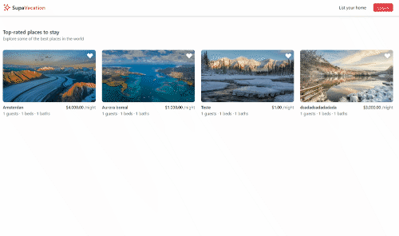

Build a FullStack App with Next.js, Supabase & Prisma | The Modern Dev by
[AlterClass.io](https://alterclass.io).

Project made in the course [The Modern Dev](https://themodern.dev/).





## Getting Started

### 1. Clone the repository and install dependencies

```
git clone https://github.com/AlterClassIO/supa-vacation
cd supa-vacation
npm install
```

### 2. Configure your local environment

Rename the `.env.example` file in this directory to `.env` (which
will be ignored by Git):

```
cp .env.local.example .env.local
```

Add your own values for all the environment variables.

### 3. Start the application

To run your site locally, use:

```
npm run dev
```

To run it in production mode, use:

```
npm run build
npm run start
```

## License

[MIT](https://github.com/AlterClassIO/supa-vacation/blob/master/LICENSE)
